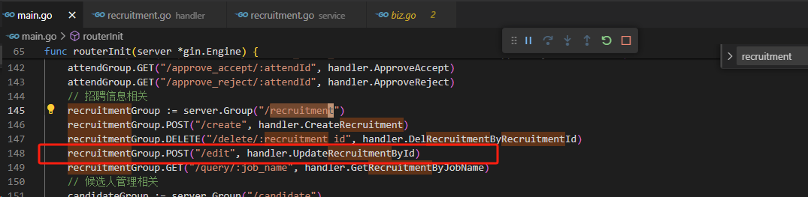
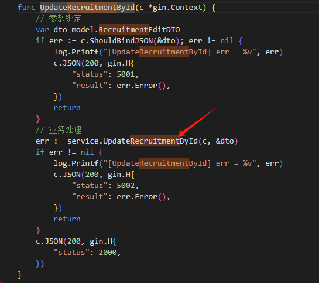
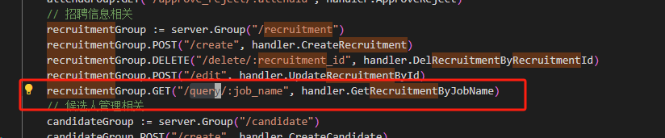
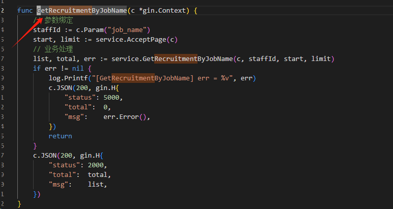
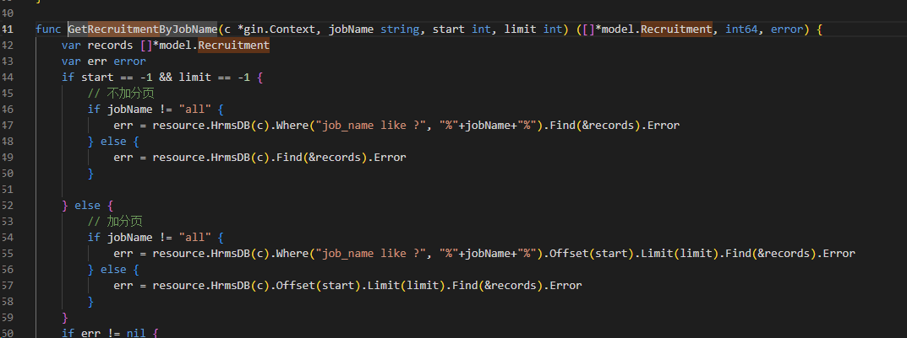
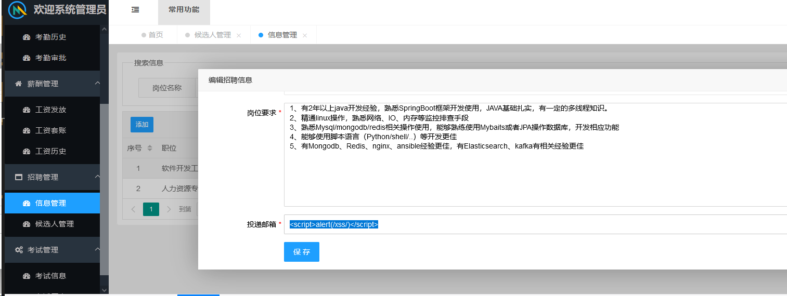

[Title]
Pbrong/hrms has a Stored Cross Site Scripting vulnerability

[PRODUCT]
[hrms1.0.1](https://github.com/pbrong/hrms/releases/tag/1.0.1)

[TYPE]
Stored Cross Site Scripting Vulnerability

[DESCRIPTION]
Pbrong/hrms has a Stored Cross Site Scripting vulnerability. This vulnerability is due to the fact that the UpdateRecruitmentById function under hrms1.0.1/handler/recruitment.go does not filter the parameters passed by the user, resulting in the system being able to parse javascript and Stored Cross Site Scripting vulnerability.

ANALYZE：

Find any place where you can fill in the information, such as: recruitment information-related `recruitment`, first obtain the data and then enter it to `UpdateRecruitmentById`:

Then deposit it into `service.UpdateRecruitmentById`, and then put it into the database:

If it is displayed, enter the `query` route:

Enter the `GetRecruitmentByJobName` method:

Get data through `service.GetRecruitmentByJobName`:

During this period, no `xss` filtering was done, resulting in the existence of storage-type `xss` vulnerabilities.

POC：

Enter the recruitment management function:

# submitter
- Guozhao Liao, Yang Hou, Jie Zhu, Lujia Chai, Sidi Jiang
- Department and Organization: School of Cyberspace Security (School of Cryptology), Hainan University
